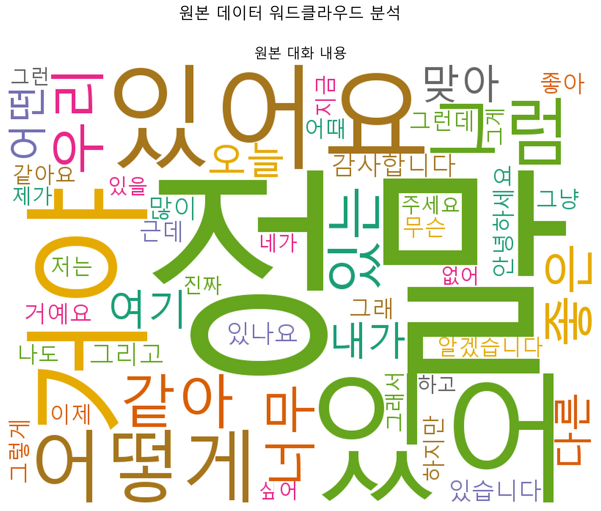
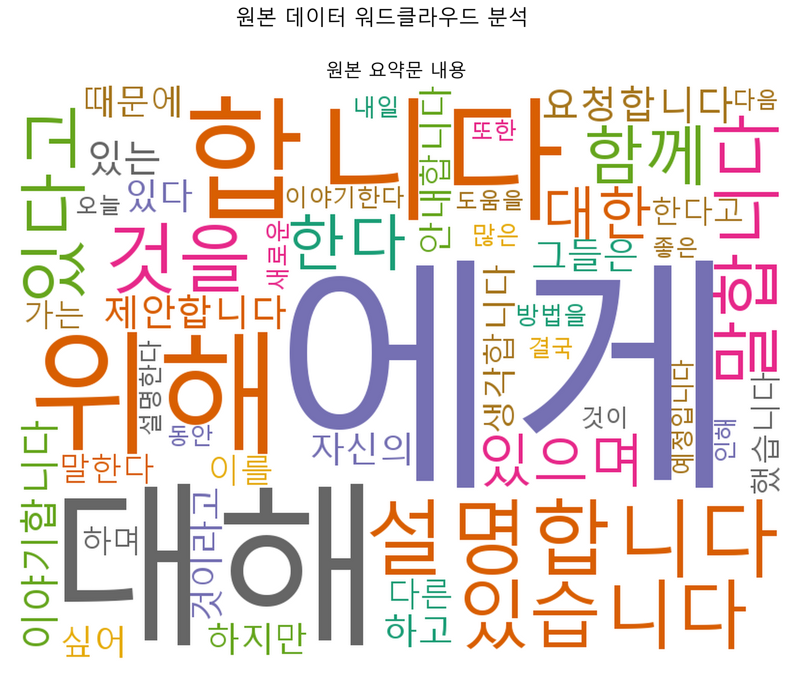

# Title (Please modify the title)
## Team

|  |  |  |  |
| :--------------------------------------------------------------: | :--------------------------------------------------------------: | :--------------------------------------------------------------: | :--------------------------------------------------------------: |
|            [김주형](https://github.com/UpstageAILab)             |            [김재훈](https://github.com/UpstageAILab)             |            [김문수](https://github.com/UpstageAILab)             |            [채병기](https://github.com/UpstageAILab)             |
|                            팀장, 담당 역할                             |                            담당 역할                             |                            담당 역할                             |                            담당 역할                             |

## 0. Overview
### Environment
- _Write Development environment_

### Requirements
- pandas==2.1.4
- numpy==1.23.5
- wandb==0.16.1
- tqdm==4.66.1
- pytorch_lightning==2.1.2
- transformers[torch]==4.35.2
- rouge==1.0.1
- jupyter==1.0.0
- jupyterlab==4.0.9

## 1. Competiton Info

### Overview

- _Write competition information_

### Timeline

- January 10, 2024 - Start Date
- February 10, 2024 - Final submission deadline

## 2. Components

### Directory

- 파일 간단 구조입니다.

```
├── code
│   ├── baseline.ipynb
│   ├── requirements.txt
│   ├── augment.py
│   ├── augment_back_translation.py
│   ├── analyze_augmentation.py
│   ├── baseline_advanced.ipynb
│   ├── solar_api.ipynb
│   ├── config.yaml
```

## 3. Data descrption

### Dataset overview

[대회 데이터셋 License]

- DialogSum Dataset: CC BY-NC-SA 4.0 license

- 단, 해당 데이터을 한국어로 번역하여 활용

- 원본: [사이트](https://github.com/cylnlp/dialogsum)

### EDA

- 개인 정보 마스킹 스페셜 토큰 확인
```bash
전화번호 → #PhoneNumber#
주소 → #Address#
생년월일 → #DateOfBirth#
여권번호 → #PassportNumber#
사회보장번호 → #SSN#
신용카드 번호 → #CardNumber#
차량 번호 → #CarNumber#
이메일 주소 → #Email
```

- 원본 데이터 워드 클라우드 결과



### Data Processing

- 데이터 증강 적용
    - 구글 번역 api로 번역 진행, 한 -> 영 -> 한, 한 -> 영 -> 일 -> 한, 한 -> 일 -> 한 이런식으로 변역한 것들을 데이터 증강
- \n 와 같은 테크들 제거
- 너무 많은 화자를 2명으로 제한
- AEDA 시도


## 4. Modeling

### Model descrition

- 실험 모델
    - beomi/KoAlpaca-Polyglot-12.8B
    - gogamza/kobart-summarization
    - KETI-AIR/ke-t5-base-ko
    - paust/pko-t5-base
    - eenzeenee/t5-small-korean-summarization
    - gangyeolkim/kobart-korean-summarizer-v2
    - facebook/bart-base
    - alaggung/bart-r3f
    - digit82/kobart-summarization
    - t5-base
    - google/pegasus-xsum
    - allenai/led-base-16384
    - microsoft/prophetnet-large-uncased
    - unsloth/Qwen3-4B-Base

### Modeling Process

- 다양한 모델을 사용해 보았지만, 결국 베이스라인으로 제공된 모델의 성능을 넘지 못했음
- 

## 5. Result

### Leader Board


